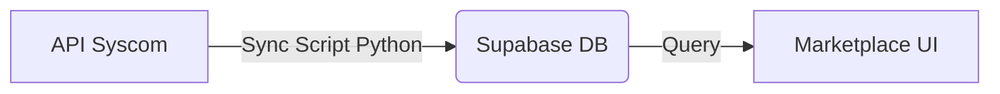
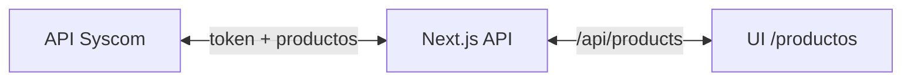

# Arquitecturas: Syscom en distintos proyectos

Comparación de cómo se usa la API de Syscom en **otro proyecto (Sumee/marketplace con Supabase)** frente a **SeguridadAvanzadaShop**.

---

## 1. Otro proyecto: Sync → Base de datos → UI

Flujo que describiste:

```
API Syscom  →  Sync Script (Python)  →  Supabase DB  →  Query  →  Marketplace UI
```

En detalle:

1. **API Syscom:** Origen de verdad de productos (catálogo, precios, categorías).
2. **Sync Script (Python):** Se ejecuta de forma programada o manual. Obtiene token, pide productos por categoría (paginado), mapea al esquema del marketplace e **inserta/actualiza** en Supabase (`marketplace_products`, `marketplace_categories`, etc.). Respeta rate limit (60 req/min).
3. **Supabase DB:** Copia persistente de productos. La UI **nunca** llama a Syscom en tiempo real.
4. **Marketplace UI:** Lee solo de Supabase (filtros, búsqueda, paginación, conteos). Rápido y sin depender de la disponibilidad de Syscom en cada carga.

**Ventajas:** UI rápida, búsqueda/filtros sobre tu propia BD, puedes enriquecer datos (scoring, vistas, etc.). **Desventajas:** Los productos no son “en vivo”; hace falta ejecutar el sync con la frecuencia que necesites.

### Flujo detallado de sincronización (otro proyecto)

1. **Mapeo de categorías**  
   Se asocian IDs de Syscom (ej. `22`) con slugs de tu BD (ej. `videovigilancia`). El script sabe a qué categoría/subcategoría de Supabase pertenece cada producto según la categoría que devuelve Syscom.

2. **Extracción**  
   Descarga productos **página por página** desde la API de Syscom (por categoría, con `pagina` y `limit`), respetando el rate limit (60 req/min).

3. **Transformación**  
   - **Precios:** Se normaliza el precio priorizando `precio_especial` o `precio_descuento` sobre el de lista; si no hay especial/descuento, se usa precio lista.  
   - **Campos:**  
     - `producto_id` (Syscom) → **`external_code`** en tu tabla.  
     - `modelo` (Syscom) → **`sku`** en tu tabla.  
   El resto (título, descripción, imágenes, categoría, etc.) se mapea al esquema de `marketplace_products`.

4. **Carga (Upsert)**  
   - Se verifica si el producto ya existe en Supabase usando **`external_code`**.  
   - **Si existe:** Se actualiza precio y stock (y opcionalmente imágenes, descripción).  
   - **Si no existe:** Se inserta como nuevo.  
   Así se evitan duplicados y se mantienen los productos al día en cada ejecución del sync.

5. **Base de datos (Supabase)**  
   - Los productos **viven en tu tabla** `marketplace_products`, no en Syscom.  
   - **Campo clave:** `external_code` guarda el ID original de Syscom (ej. `145823`) para las futuras sincronizaciones (upsert).  
   - **Seller:** Se asignan a un usuario “admin” (ej. UUID `0ad1a921-...`) para que aparezcan como vendidos por Sumee (o tu marca).

6. **Frontend (`src/app/marketplace/` o equivalente)**  
   - El usuario final **nunca** toca la API de Syscom.  
   - El marketplace consulta solo **`marketplace_products`** en Supabase.  
   - La carga es rápida y se pueden **mezclar** productos de Syscom con productos de otros orígenes (ej. Truper, vendedores propios) sin que el frontend distinga el origen; todo es una sola tabla (o vistas) en tu BD.

---

## 2. SeguridadAvanzadaShop: En vivo desde la API

Flujo actual de este repo:

```
API Syscom  ←→  Next.js (API Routes + lib/syscom-client)  ←→  UI (/productos)
```

1. **API Syscom:** Misma fuente (developers.syscom.mx).
2. **Next.js:** Las rutas (`/api/products`, etc.) obtienen token, llaman a Syscom (categoria, q, pagina, limit), aplican margen/precios en MXN y devuelven JSON. No hay base de datos de productos; todo pasa por el proxy.
3. **UI:** La página `/productos` (y detalle por SKU) consume `/api/products`. Cada listado/búsqueda es una petición a Syscom (con cache de 1 min en el cliente).

**Ventajas:** Catálogo siempre al día con Syscom, sin scripts ni BD que mantener. **Desventajas:** Dependes de Syscom en cada carga; búsqueda/filtros limitados a lo que la API ofrezca; rate limit compartido entre todos los usuarios.

---

## 3. Diagrama comparativo

**Otro proyecto (Sync a Supabase):**



**SeguridadAvanzadaShop (en vivo):**



---

## 4. Cuándo usar cada enfoque

| Criterio | Sync → Supabase (otro proyecto) | En vivo (SeguridadAvanzadaShop) |
|---------|----------------------------------|----------------------------------|
| Actualización de precios/stock | Según frecuencia del sync | En cada petición (o cache 1 min) |
| Carga en la UI | Muy baja (solo BD) | Depende de Syscom + cache |
| Búsqueda/filtros | Totalmente en tu BD | Lo que permita la API Syscom |
| Mantenimiento | Script + cron + BD | Solo código Next + credenciales |
| Rate limit Syscom | Solo durante el sync | Repartido entre todas las peticiones de usuarios |

En resumen: **el otro proyecto** usa Syscom como “origen” y Supabase como “capa de servicio” para la UI. **SeguridadAvanzadaShop** usa Syscom como “backend” en tiempo real, sin capa intermedia de BD.
